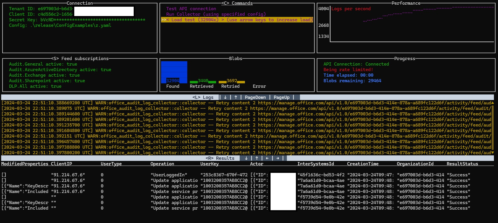

# Anouncements:

Due to a busy real life schedule I have noticed I am not able to support this tool as much as I want to.
This has resulted in issues staying open for too long. In order to remedy this some radical changes were needed:


#### Full Rust rewrite

The engine was already rewritten in Rust for performance. Looking at the issues however, most crashes came from Pythons
loose typing. Building in PyInstaller was also a drag due to some libs not playing nice with it. Now the entire tool has been
rewritten in Rust, I'm hoping for more stability.

#### Support only what is necessary

Many interfaces and config options have become superfluous. For example, most Azure interfaces are now useless, as
Azure Sentinel supports direct retrieval of audit logs. By including only the features that will actually be used in the
rewrite, I'm hoping I'll be able to maintain the smaller codebase in my limited free time. The new interfaces are:
- Csv file
- Graylog
- Fluentd
- Azure Log Analytics

If you were using an interface that was dropped, keep using the previous version and raise an issue asking for the 
interface to be included. I don't mind writing an interface for one person, I only mind writing it for no one.


#### Interactive interface

An interactive terminal interface was added, which allows testing the API connection, retrieving logs, and load testing
by downloading each log an arbitrary number of times. This should allow live troubleshooting and testing, which might
make solving issues easier. You can use it by running the collector as normal, only adding the '--interactive' command
line parameter.

#### Add container releases

While binaries will still be available, the primary method of release should be containers. This will hopefully
reduce the amount of questions people have regarding how to run the tool, as only the container and a config file will
be necessary.


# Office365 audit log collector



Collect/retrieve Office365, Azure and DLP audit logs, optionally filter them, then send them to one or more outputs 
(see full list below).
Onboarding is easy and takes only a few minutes (see 'Onboarding' section). There are Windows and Linux executables.
Configuration is easy with a YAML config file (see the 'ConfigExamples' folder for reference).
If you have any issues or questions, or requests for additional interfaces, feel free to create an issue in this repo. - The following Audit logs can be extracted:
  - Audit.General
  - Audit.AzureActiveDirectory
  - Audit.Exchange
  - Audit.SharePoint
  - DLP.All
- The following outputs are supported:
  - Graylog (or any other source that accepts a simple socket connection)
  - Fluentd
  - CSV Local file

Feel free to contribute other outputs if you happen to build any. Also open to any other useful pull requests!
See the following link for more info on the management APIs: https://msdn.microsoft.com/en-us/office-365/office-365-management-activity-api-reference.

## Use cases:

- Ad-lib log retrieval;
- Scheduling regular execution to retrieve the full audit trail
- Output to Graylog/fluentd for full audit trails in SIEM
- Etc.

## Instructions:

### Onboarding (one time only):
- Make sure Auditing is turned on for your tenant!
  - Use these instructions: https://docs.microsoft.com/en-us/microsoft-365/compliance/turn-audit-log-search-on-or-off?view=o365-worldwide
  - If you had to turn it on, it may take a few hours to process
- Create App registration: 
  - Azure AD > 'App registrations' > 'New registration':
    - Choose any name for the registration
    - Choose "Accounts in this organizational directory only (xyz only - Single tenant)"
    - Hit 'register'
    - Save 'Tenant ID' and 'Application (Client) ID' from the overview page of the new registration, you will need it to run the collector
- Create app secret:
  - Azure AD > 'App registrations' > Click your new app registration > 'Certificates and secrets' > 'New client secret':
    - Choose any name and expire date and hit 'add'
      - Actual key is only shown once upon creation, store it somewhere safe. You will need it to run the collector.
- Grant your new app registration 'application' permissions to read the Office API's: 
  - Azure AD > 'App registrations' > Click your new app registration > 'API permissions' > 'Add permissions' > 'Office 365 Management APIs' > 'Application permissions':
    - Check 'ActivityFeed.Read'
    - Check 'ActivityFeed.ReadDlp'
    - Hit 'Add permissions'
- You can now run the collector and retrieve logs. 


### Running the collector:

#### From container (recommended)

A prebuilt container is available. If you are on a machine with docker available,
you can run the tool through following steps:

1. Make sure a config file is available (see "/ConfigExamples" for details). Let's say the file is at "/configs/config.yaml"
2. Run the following docker command:
    - Note we create a volume (/config), binding the local config folder to the container
    - We also mount a new volume (/app) that the collector can use to store known logs, so it can avoid duplicates
```
sudo docker run -d \
  -v /configs:/configs \
  --mount source=collector-volume,target=/app \
  ghcr.io/ddbnl/office365-audit-log-collector:release \
  --tenant-id "11111111-1111-1111-1111-111111111111" \
  --client-id "11111111-1111-1111-1111-111111111111" \
  --secret-key "1111111111111111111111111111111111" \
  --config /configs/graylog.yaml

```
3. Now optionally create a CRON job or Task Scheduler task to run the container on a schedule

#### From a custom container

You can use "/Release/Dockerfile" as a starting point to create a custom container. The binary is located at 
"/Release/Linux/OfficeAuditLogCollector"

#### Direct From binary
To run the command-line executable use the following syntax:

OfficeAuditLogCollector(.exe) --tenant-id %tenant_id% --client-id %client_key% --secret-key %secret_key% --config %path/to/config.yaml%

To create a config file you can start with the 'fullConfig.yaml' from the ConfigExamples folder. This has all the 
possible options and some explanatory comments. Cross-reference with a config example using the output(s) of your choice, and you
should be set. Remember to remove (or comment out) all the outputs you do not intent to use.

You can schedule to run the executable with CRON or Task Scheduler.

### Setting up the collector for Graylog:
I wrote a full tutorial on the Graylog blog. You can find it
[here](https://community.graylog.org/t/collecting-office365-azuread-audit-logs-using-office-audit-collector/23925).